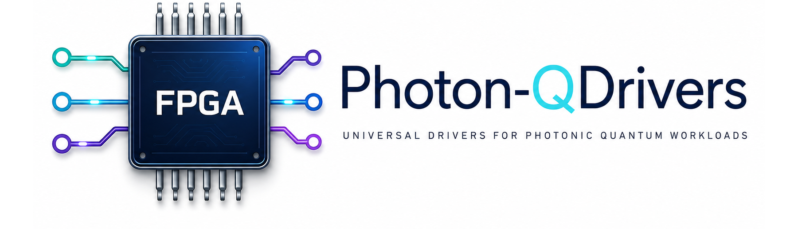
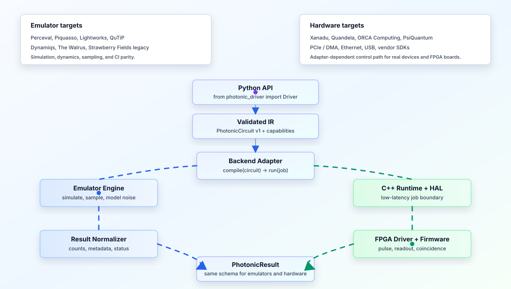

<p align="center">
  
</p>

[](LICENSE)
[](https://github.com/denniswayo/photon-qdrivers/actions/workflows/ci.yml)


**Photon-QDrivers is a universal driver layer for photonic quantum workloads:
one Python API for emulators, native runtime paths, FPGA firmware, and hardware
vendor adapters.**

> Why QDrivers

Photonic quantum systems need more than simulator bindings or vendor SDK calls.
They need a stable driver layer that can validate circuits, describe device
capabilities, route jobs to emulators or hardware, and normalize results across
very different execution targets.

Photon-QDrivers keeps that boundary explicit: Python for users, C++ for the
runtime path, HAL contracts for devices, FPGA modules for timing-critical
control, and plugins for simulators, decoders, and vendor integrations.

> What It Provides

- A concise public API: `from photonic_driver import Driver`.
- A validated `PhotonicCircuit` IR shared by emulators and hardware backends.
- Backend capability checks for modes, shots, operations, and device limits.
- Emulator integration paths for photonic and quantum-optics engines.
- Hardware adapter paths through C++ runtime, HAL, FPGA driver, and firmware.
- Optional plugin hooks for simulator and decoder workflows.

<p align="center">
  
</p>

## Performance Landscape

Public hardware and emulator metrics are not directly comparable: hardware
vendors report sampling speed, QOPS, fidelity, deployment, or power, while
emulators report simulation methods and acceleration paths. Photon-QDrivers uses
these signals to shape backend contracts, capability discovery, and benchmark
coverage.

### Hardware Targets

| Target | Public performance signal | Driver implication |
| --- | --- | --- |
| [Xanadu Borealis](https://www.nature.com/articles/s41586-022-04725-x) | 216 squeezed modes; about 36 us per sample; events up to 219 photons. | Batch-first sampling, compact IR lowering, streaming results, loss/noise metadata. |
| [Quandela Ascella / MosaiQ-6](https://www.quandela.com/products-and-services/ascella/) | 12 modes, QOPS 144, 99.6% 1-qubit gate fidelity, 99.0% 2-qubit gate fidelity, 99% readout fidelity. | Device capability profiles, fidelity metadata, cloud execution, Perceval/Qiskit/myQLM compatibility. |
| [Quandela Belenos / MosaiQ-12](https://www.quandela.com/products-and-services/belenos/) | 24 modes, QOPS 576, 12 fully entangled qubits, 8 kW main-system power. | Scaling tests for modes, shots, entangled-qubit limits, and device profile negotiation. |
| [ORCA PT Series](https://orcacomputing.com/orca-pt-2/) | Rack-mounted, room-temperature photonic systems for hybrid quantum/AI/HPC workflows. | On-prem execution, scheduler integration, Python/PyTorch-style workflows, low-overhead job submission. |
| [PsiQuantum](https://www.psiquantum.com/) | Utility-scale fault-tolerant photonic platform in development; silicon photonics and FTQC software focus. | Offline FTQC compilation, resource estimation, and software interoperability before live QPU access. |

### Emulator And Software Targets

| Target | Public performance signal | Driver implication |
| --- | --- | --- |
| [Perceval](https://github.com/Quandela/Perceval) | C-optimized simulation backends and direct Quandela QPU access. | Primary discrete-variable photonic emulator and Quandela validation path. |
| [Piquasso](https://piquasso.readthedocs.io/en/stable/) | Gaussian, Fock, and boson-sampling simulators with JAX/optimized backend paths. | Strong Gaussian/Fock adapter for differentiable and accelerator-ready workflows. |
| [Lightworks](https://aegiq.github.io/lightworks/) | Linear-optics SDK with emulator backends, error models, tomography, and dual-rail tools. | Linear-optics validation, QPU encoding checks, and dual-rail compilation experiments. |
| [The Walrus](https://the-walrus.readthedocs.io/en/latest/) | Fast hafnian, loop hafnian, torontonian, and GBS kernels powered by Numba. | Kernel-level validation for GBS probabilities and sampling cross-checks. |
| [QuTiP](https://qutip.org/qutip-benchmark/) / [Dynamiqs](https://www.dynamiqs.org/stable/) | Open-system solvers, benchmark tracking, JAX acceleration, differentiable and batched dynamics. | Quantum-optics noise, source, detector, and dynamics modelling. |
| [Strawberry Fields](https://github.com/XanaduAI/strawberryfields) / [PennyLane-SF](https://github.com/PennyLaneAI/pennylane-sf) | Legacy CV photonic stack; Strawberry Fields archived and PennyLane-SF no longer supported for newer PennyLane. | Optional legacy compatibility only, isolated from the modern core API. |

See [Performance landscape](docs/performance_landscape.md) for the detailed
sourced table and benchmark-design notes.

## Quick Start

### Emulator

```python
from photonic_driver import Driver

circuit = {
    "type": "photonic_circuit",
    "modes": 4,
    "operations": [
        {"gate": "BS", "modes": [0, 1]},
        {"gate": "PS", "mode": 0, "theta": 0.5},
        {"measure": "photon_counting", "modes": [0, 1, 2, 3]},
    ],
    "shots": 1000,
    "metadata": {"input_state": [1, 1, 0, 0]},
}

driver = Driver.load("perceval")  # requires an installed/configured adapter

job = driver.compile(circuit)
result = driver.run(job)

driver.use_plugin("schrosim")
driver.use_plugin("lidmas")
```

Install optional emulator adapters as needed:

```bash
python -m pip install ".[emulators]"
python -m pip install ".[perceval]"
python -m pip install ".[piquasso]"
python -m pip install ".[lightworks]"
python -m pip install ".[thewalrus]"
python -m pip install ".[qutip]"
python -m pip install ".[dynamiqs]"
python -m pip install ".[strawberryfields]"
```

The full emulator surface spans two Python compatibility bands. Use Python 3.12+
for modern adapters such as Dynamiqs. Use Python 3.10 for the legacy Strawberry
Fields/Xanadu path, which requires older NumPy/SciPy compatibility.

### Hardware

```python
from photonic_driver import Driver

driver = Driver.load("quandela")  # requires credentials and .[quandela]

job = driver.compile(circuit)
result = driver.run(job)

driver.use_plugin("schrosim")
driver.use_plugin("lidmas")
```

Install implemented vendor adapters as needed:

```bash
python -m pip install ".[hardware]"
python -m pip install ".[quandela]"
python -m pip install ".[psiquantum]"
```

The same backend shape is used for `xanadu`, `orca`, and `psiquantum`.
`xanadu` is available only as a legacy Strawberry Fields/XCC adapter for private
or archived Xanadu Cloud-compatible endpoints. `orca` supports private ORCA SDK
modules and configurable HTTPS endpoints. `psiquantum` uses PsiQDK / Construct
for FTQC resource estimation and local simulation rather than live QPU
execution. The public `hardware` extra intentionally excludes `psiqdk` because
that package is not available from the public Python index in all environments;
install `.[psiquantum]` only where the PsiQuantum SDK is available.

For local smoke tests without external SDKs, use `Driver.load("mock")`.
For the compiled host-runtime path, build with CMake and use
`Driver.load("native")`. The native backend can also target FPGA command/result
mailboxes with `transport="fpga_mailbox"` or the Red Pitaya profile with
`transport="red_pitaya"`; see `docs/cpp_runtime.md`.

## Examples

Runnable scripts live in [docs/examples](docs/examples/README.md):

```bash
python docs/examples/run_mock_device.py
python docs/examples/run_local_emulator.py
python docs/examples/run_optional_sampling_adapters.py
python docs/examples/run_thewalrus_kernel.py
python docs/examples/run_qutip_dynamics.py
python docs/examples/run_native_runtime.py
```

## Development

```bash
pytest
cmake -S . -B build
cmake --build build
```
