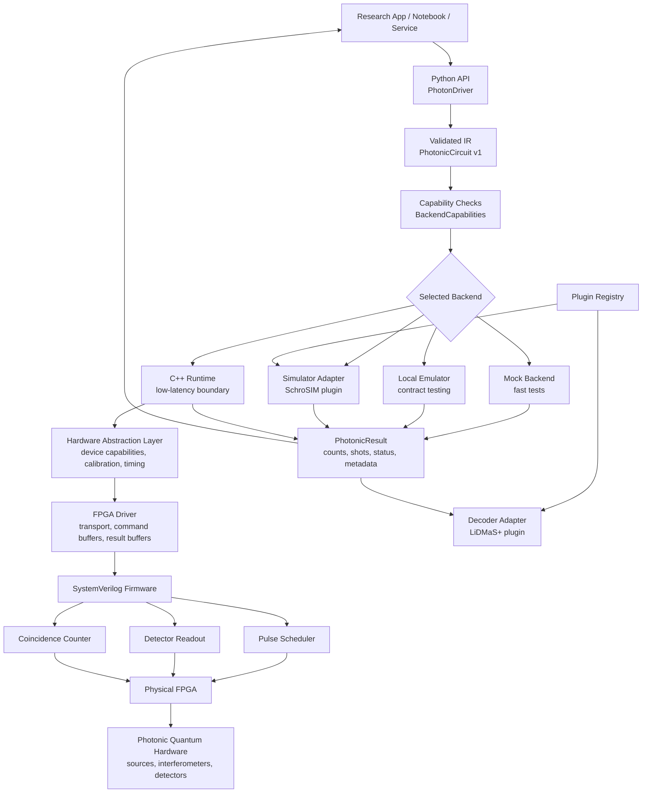
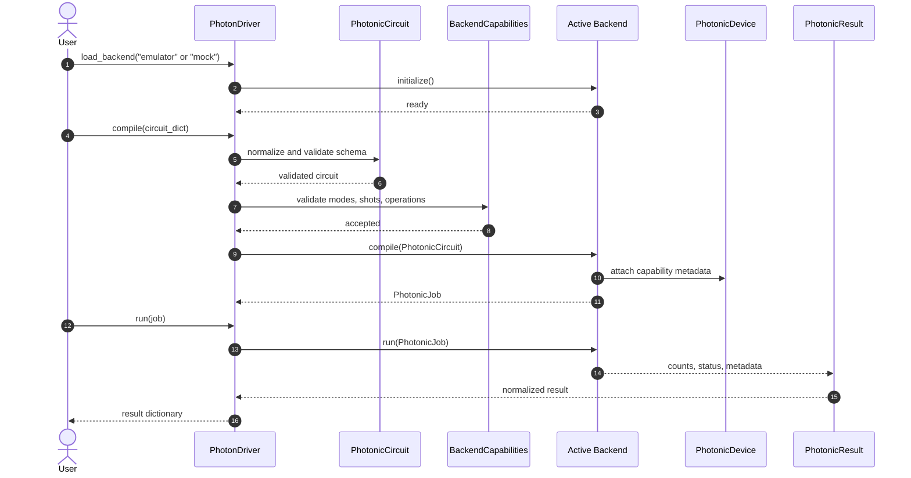
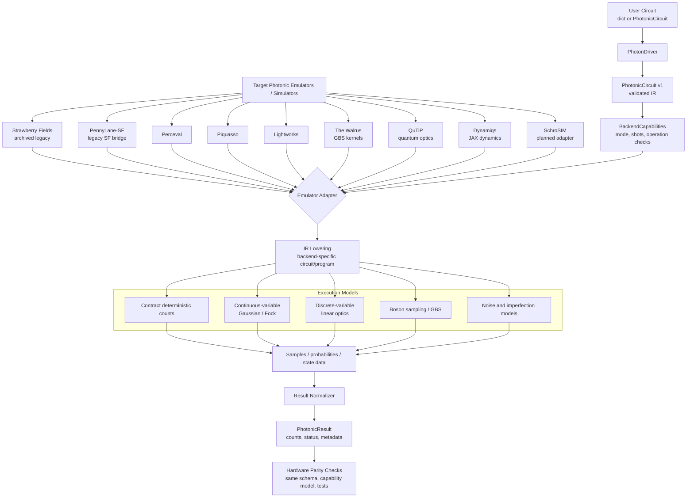
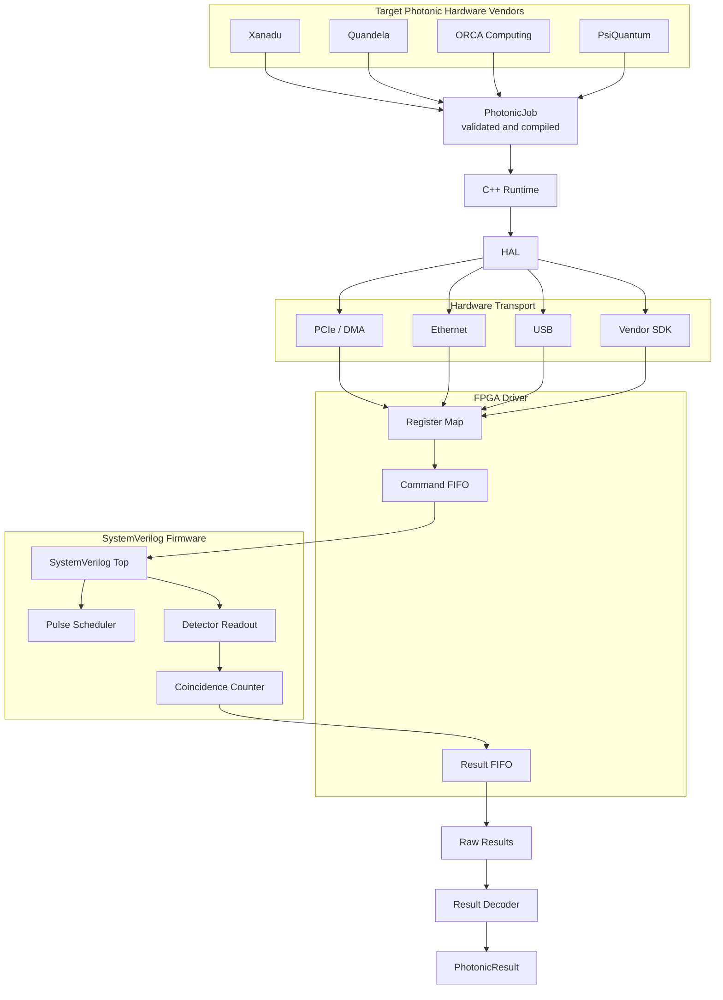
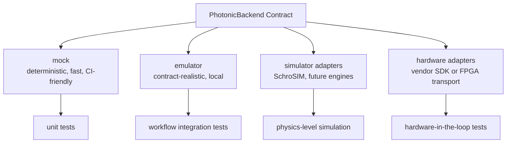

# Architecture

Photon-QDrivers is organized around a layered control path:

## System Architecture

The current implementation already supports the Python API, validated IR, mock
backend, local emulator backend, plugin placeholders, C++ runtime boundary, HAL
boundary, FPGA driver boundary, and SystemVerilog module stubs.

## Compile and Run Flow

## Emulator Execution Path

The target list separates real external engines from the internal deterministic
test backend. The built-in contract emulator remains useful for CI and result
schema tests, but it is not treated as a target physics emulator.

Emulator target roles:

- Perceval, Piquasso, and Lightworks: primary photonic circuit/sampling engines.
- QuTiP and Dynamiqs: quantum-optics and open-system dynamics engines for
  cavity, source, detector, loss, and noise modelling.
- The Walrus: Gaussian boson sampling and hafnian/torontonian kernels.
- Strawberry Fields and PennyLane-SF: legacy Strawberry Fields-family adapters.
- SchroSIM: planned adapter placeholder.

## Hardware Execution Path

## Backend Types

## Python API

The Python layer is the user-facing surface. It should remain convenient for
research code, notebooks, experiment orchestration, and CI simulation. The
initial `PhotonDriver` supports backend loading, symbolic compilation, job
execution, plugin registration, and registry inspection.

The Python API should not grow direct dependencies on vendor SDKs, FPGA tools,
or simulator packages unless those integrations are optional plugins.

Circuits are normalized into `PhotonicCircuit`, a versioned intermediate
representation. Backends receive validated IR objects instead of arbitrary
dictionaries. That contract is required before emulator or hardware adapters can
be made reliable.

## Backend Contract

All backends must expose:

- A stable `name`.
- A `PhotonicDevice` description.
- `initialize()`.
- `compile(circuit)`.
- `run(job)`.

Backends also publish `BackendCapabilities` so the driver can reject unsupported
mode counts, shot counts, and operations before execution.

## C++ Runtime

The C++ runtime is the future boundary for low-latency execution, resource
ownership, and Python bindings. It currently exposes placeholder methods:

- `initialize()`
- `submit_job()`
- `read_results()`
- `shutdown()`

The first real runtime milestone should define a stable job representation that
can be produced from Python and consumed by hardware or simulator backends.

## Hardware Abstraction Layer

The HAL should describe device-independent capabilities:

- Number of optical modes.
- Available operations and timing constraints.
- Detector topology.
- Calibration state.
- Result formats.
- Firmware and board capabilities.

Vendor-specific adapters should translate HAL calls into their own SDKs or
transport protocols.

## FPGA Driver

The FPGA driver owns communication with the FPGA image. Depending on board and
vendor, this may later mean PCIe, Ethernet, USB, AXI, DMA, memory-mapped IO, or
a vendor runtime. The initial C++ class only preserves the interface boundary.

## Firmware

The SystemVerilog stubs define first firmware responsibilities:

- Pulse scheduling.
- Detector readout.
- Coincidence counting.
- Top-level signal integration.

These modules are intentionally simple and should be expanded with testbenches,
clock-domain crossing rules, bus protocols, and board constraints before they
are treated as hardware-ready.
